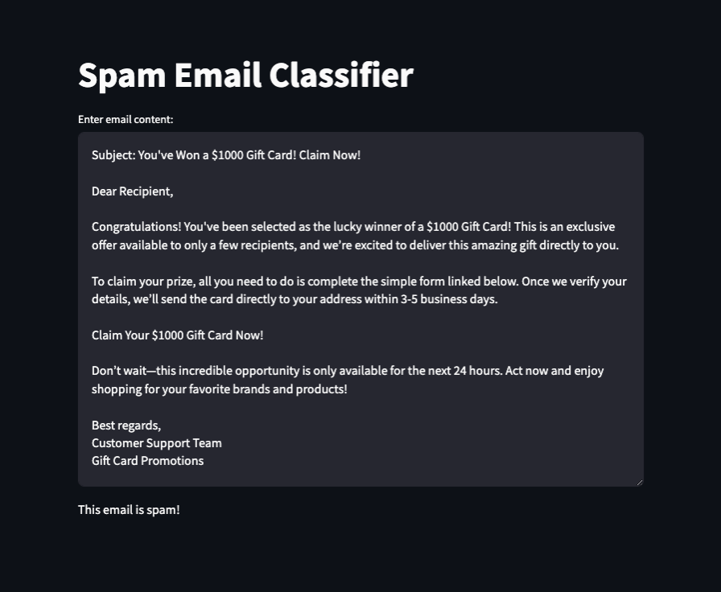

# AI Spam Detection Classifier 

This project is an AI-powered spam detection tool designed to identify and classify spam messages with high accuracy. It leverages advanced machine learning techniques (Naive Bayes, Support Vector Machine) to analyze text and distinguish between legitimate and spam content.

Key Features:
* Content-Based Analysis: The classifier focuses solely on the content (body) of the email, ignoring other elements like subject lines or sender information.
* Machine Learning Model: Trained on a dataset of labeled messages to detect spam effectively.
* Efficient Spam Detection: Quickly identifies spam messages with minimal false positives.
* Pretrained Model: Built on real-world data for reliable performance.
* Easy Integration: Can be implemented into email systems, messaging platforms, or any text-based application.

This project is aimed at students, developers, educators, and enthusiasts looking to explore AI applications in text classification. It's designed as an inspirational and educational resource to showcase what's possible with AI and machine learning in spam detection.


## Demo



## Installation

Requirements: 

This project requires [Conda](https://anaconda.org/anaconda/conda) to manage the environment and its dependencies for running a Jupyter notebook. Conda is used to create an isolated environment with all necessary packages to run the notebook, ensuring consistency across different setups.


1: Clone the Repository

```bash
git clone https://github.com/OscarKaluza/AISpamClassifier.git
```

2: Set Up the Environment

```bash # Navigate to the project directory
cd AISpamClassifier  

# Create a new conda environment 
conda env create -f environment.yml

# Activate the environment
conda activate env-name

```

3: Run the notebook
```
jupyter notebook
```
## License

The dataset used to train the model is sourced from Kaggle: [Spam or Ham: A Dataset for Email Classification](https://www.kaggle.com/datasets/haldonmez/spam-or-ham-a-dataset-for-email-classification/data).

This dataset is verified for public use under the [Creative Commons Zero (CC0) 1.0 License](https://creativecommons.org/publicdomain/zero/1.0/).


